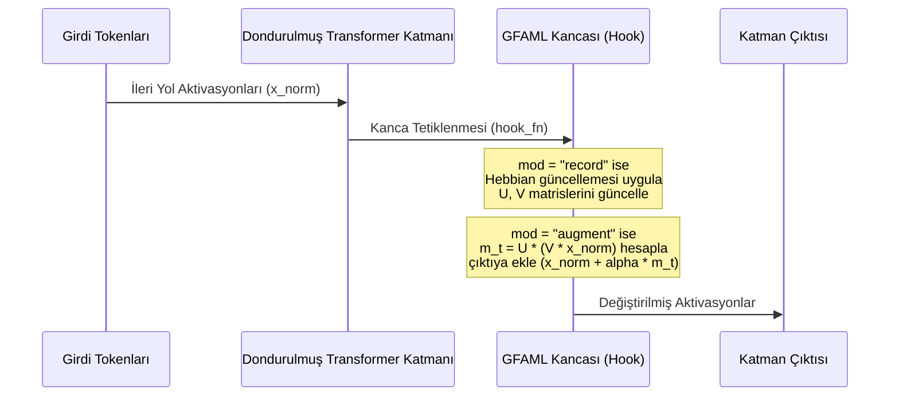

# GFAML: Geliştirici Kılavuzu ve Kod Tabanı Mimarisi
## Geliştirici El Kitabı

Bu kılavuz, GFAML kütüphanesinin iç yapısını anlamak, mevcut deneyleri koşturmak ve gelecekte projeyi yeni modellerle (örn. Gemma, Llama 3) genişletmek isteyen geliştiriciler için teknik bir referans olarak hazırlanmıştır.

---

## 1. Kod Tabanı Dizin Haritası

Proje dizin yapısı modüler ve genişletilebilir şekilde tasarlanmıştır:

```text
GFAML Gradient-Free Associative Memory Layers/
│
├── gfaml/                     # Çekirdek Kütüphane (Core Library)
│   ├── config.py              # Hiperparametreler (rank, alpha, eta, decay vb.)
│   ├── memory/
│   │   ├── gfaml.py           # GFAMLLayer (Okuma, kapılama, güncelleme akışı)
│   │   ├── gating.py          # Bellek yazma kapısı (surprise-gating / perfect-gating)
│   │   └── update_rules.py    # Hebbian dış çarpım kuralları & norm sınırlaması
│   └── cortex/
│       ├── lora.py            # Parametrik Kortex için LoRA adaptörleri
│       └── sleep.py           # Sleep konsolidasyonu (SleepOptimizer)
│
├── experiments/               # Ar-Ge ve Ablasyon Deneyleri (Exp 1 - 12)
│   ├── exp_06_real_gpt2.py    # İlk GPT-2 entegrasyon denemesi
│   ├── exp_11_decoupled.py   # İlk dekupe wake-sleep deneyi
│   └── exp_12_scaled_benchmark.py # 10-Task train/test split kıyaslama suite'i
│
├── scripts/                   # Canlı Sohbet ve Test Araçları
│   ├── chat_gfaml.py          # Qwen-2.5-0.5B ile canlı bellekli sohbet arayüzü
│   ├── test_instant_learn.py  # Anlık öğrenme e2e doğrulama testi
│   └── generate_plots.py      # Metrik görselleştirme aracı
│
├── outputs/                   # Deney çıktıları ve otomatik üretilen raporlar
└── papers/                    # Akademik makale taslakları (draft.md)
```

---

## 2. Kanca (Hook) Entegrasyonu ve Aktivasyon Müdahalesi

GFAML, dondurulmuş (frozen) transformer katmanlarının residual akışına doğrudan sızmak için PyTorch'un `forward_hook` mekanizmasını kullanır.



`experiments/exp_12_scaled_benchmark.py` içerisindeki kanca kaydı şu şekilde gerçekleşir:
```python
def _register_hooks(self):
    for i, block in enumerate(self.layers):
        attn_module = getattr(block, self.attn_name)
        
        def make_hook(layer_idx):
            def hook_fn(module, args, kwargs, hook_output):
                # Detaylı kod exp_12_scaled_benchmark.py içindedir.
                # 'record' modunda Hebbian yazma yapar.
                # 'augment' modunda bellekten okunan vektörü attention çıktısına ekler.
                ...
                return modified_output
            return hook_fn
        
        handle = attn_module.register_forward_hook(make_hook(i), with_kwargs=True)
        self.hook_handles.append(handle)
```

---

## 3. Çalıştırma Talimatları

### 3.1 Canlı Sohbet Arayüzü (GFAML Chat)
Qwen-2.5-0.5B modelini yükleyerek anlık epizodik bellek yazma ve okuma işlemlerini test etmek için:
```bash
python scripts/chat_gfaml.py
```
*   `/teach Soru = Cevap` formatıyla modele anında bilgi öğretebilirsiniz. (Örn: `/teach The color of grass is = green`)
*   `/debug` komutuyla token bazında tahminleri ve hedef eşleşmelerini izleyebilirsiniz.

### 3.2 Uçtan Uca Doğrulama Testi
Hebbian Boundary Write mekanizmasının doğruluğunu hızlıca test etmek için:
```bash
python scripts/test_instant_learn.py
```
Bu test, modelin öğretilen bilgileri anında geri çağırıp çağıramadığını ve genel dil yeteneklerini koruyup korumadığını otomatik olarak ölçer.

### 3.3 Ölçekleme ve Kıyaslama Deneyi (10 Tasks Benchmark)
GPT-2 (124M) üzerinde 10 farklı görevde sürekli öğrenme kıyaslamasını başlatmak için:
```bash
python experiments/exp_12_scaled_benchmark.py
```
Bu deney bittiğinde `outputs/reports/SCALED_BENCHMARK_REPORT.md` dosyasını otomatik olarak üreterek `Baseline LoRA`, `LoRA + Replay` ve `Decoupled GFAML` modellerini karşılaştırır.

---

## 4. Yeni Modellere Uyarlama Kılavuzu

GFAML mimarisini yeni bir Hugging Face modeline (örn. `google/gemma-2-2b` veya `meta-llama/Llama-3-8B`) uyarlamak için `experiments/exp_12_scaled_benchmark.py` altındaki `DecoupledGFAML` yapılandırıcısına (constructor) yeni modelin katman ve attention isimleri eklenmelidir:

```python
# Model mimarisine göre katman isimlerini dinamik tespit edin:
if hasattr(self.hf_model, "model"): # Llama & Qwen & Gemma stili
    self.model_type = "qwen_llama"
    self.layers = self.hf_model.model.layers
    self.d_model = self.hf_model.config.hidden_size
    self.attn_name = "self_attn"
elif hasattr(self.hf_model, "transformer"): # GPT-2 stili
    self.model_type = "gpt2"
    self.layers = self.hf_model.transformer.h
    self.d_model = self.hf_model.config.n_embd
    self.attn_name = "attn"
```

Katman yapıları farklı olan yeni bir model eklendiğinde tek yapılması gereken, attention modülünün adını (`self_attn`, `attn` vb.) tespit edip bu modüle forward hook kaydetmektir.
