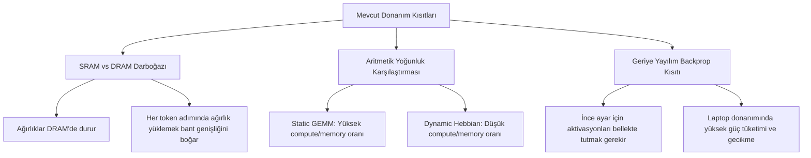

# GFAML: Matematiksel Formülasyonlar ve Donanım Kısıtları Analizi
## Derinlemesine Teknik Rapor

Bu rapor, GFAML projesinde kullanılan matematiksel modellerin denklemlerini ve bu yaklaşımların modern işlemci (GPU/TPU) mimarilerinde karşılaştığı fiziksel sınırları detaylandırmak amacıyla hazırlanmıştır.

---

## 1. Matematiksel Formülasyonlar

### 1.1 Düşük Ranklı Hebbian Güncelleme Mekanizması

Model, transformer gizli durumlarını ($h_t \in \mathbb{R}^{d}$) tam boyutlu bir bellek matrisi ($W \in \mathbb{R}^{d \times d}$) yerine düşük ranklı iki matris ($U \in \mathbb{R}^{d \times r}$ ve $V \in \mathbb{R}^{r \times d}$, $r \ll d$) üzerinden eşleştirir.

Okuma (Readout) işlemi şu şekilde tanımlanır:
$$m_t = U_t (V_t h_t)$$

Gradyansız Hebbian Güncelleme Kuralı (Delta rule / Outer product):
Gizli durumun düşük ranklı izdüşümü: $z_t = U_t^T h_t \in \mathbb{R}^{r}$
$$\Delta U_t = g_t (h_t - U_t z_t) z_t^T$$
$$\Delta V_t = g_t (z_t - V_t h_t) h_t^T$$

Burada $g_t \in [0, 1]$ kapılama (gating) katsayısıdır. Güncellenmiş bellek durumları:
$$U_{t+1} = \lambda_{\text{decay}} U_t + \eta \Delta U_t$$
$$V_{t+1} = \lambda_{\text{decay}} V_t + \eta \Delta V_t$$

### 1.2 Enerji Stabilizasyonu ve Doyum Kısıtları

Bellek matrislerinin patlamasını önlemek için iki ana stabilizasyon yöntemi geliştirilmiştir:

1. **Unit Normalization:**
   $$m_t^{\text{normed}} = \begin{cases} 
   \frac{m_t}{\|m_t\|_2} & \text{eğer } \|m_t\|_2 > \theta \\ 
   0 & \text{aksi halde} 
   \end{cases}$$

2. **Yumuşak Enerji Saturasyonu (Soft Energy Stabilization):**
   Sinyalin asimptotik olarak sınırlandırılması:
   $$m_t^{\text{stabilized}} = \frac{m_t}{\sqrt{1.0 + \|m_t\|_2^2 + \epsilon}}$$

3. **Norm Sınırlama (Frobenius Norm Constraint):**
   Her adım sonrasında $U$ ve $V$ matrislerinin aşırı büyümesini engellemek için Frobenius normu üzerinden ölçekleme uygulanır:
   $$\text{scale} = \max\left(1.0, \frac{\|W\|_F}{\gamma}\right)$$
   $$W_{\text{constrained}} = \frac{W}{\text{scale}}$$
   Burada $\gamma$ doyma eşiğidir (saturation threshold).

### 1.3 Sleep (Konsolidasyon) Evresi ve Ortogonal Gradyan İzdüşümü (OGP)

Epizodik bellekten kortekse (LoRA ağırlıkları $\Theta$) konsolidasyon sırasında geçmiş görevlerin gradyanlarının ezilmesini önlemek amacıyla OGP uygulanır.

Eski görevlerin referans gradyan uzayı: $G_{\text{past}} = [g_1, g_2, \dots, g_k]$  
Yeni gradyan vektörü $g_{\text{new}}$ hesaplandıktan sonra, eski gradyanların oluşturduğu alt uzaya dik olacak şekilde izdüşürülür:
$$g_{\text{projected}} = g_{\text{new}} - G_{\text{past}} (G_{\text{past}}^T G_{\text{past}})^{-1} G_{\text{past}}^T g_{\text{new}}$$

Bu sayede, LoRA parametreleri güncellenirken eski görevlerin performansı (Temsil Drifti = 0) korunur.

---

## 2. Donanım Seviyesinde Darboğaz Analizi

GFAML projesinin en kritik çıktılarından biri, **"sohbet esnasında gerçek zamanlı ve anlık öğrenen yapay zeka"** vizyonunun günümüz çip mimarileriyle neden verimsiz ve sınırda olduğunu ortaya koymasıdır.

### 2.1 Von Neumann ve Bellek Bant Genişliği Darboğazı (Memory Bandwidth Bottleneck)

Modern GPU'lar (NVIDIA Tensor Core vb.), ağırlık matrislerinin sabit olduğu ve girdi verilerinin (aktivasyonların) bu ağırlıklar üzerinden paralelce aktığı senaryolar için tasarlanmıştır.
*   **Sabit Ağırlık Avantajı:** Ağırlık matrisleri çip üzerindeki hızlı önbellekte (SRAM / L1-L2 cache) veya VRAM içinde statik tutulur. KV Cache gibi dinamik yapılar bile sadece girdi token sayısıyla doğrusal büyür.
*   **Dinamik Ağırlık Dezavantajı:** Hebbian güncellemeleri, her token işleme adımında (token-by-token) modelin iç katmanlarındaki bellek matrislerinin ($U$ ve $V$) kendisinin değişmesini gerektirir. Bu durum, her token için ekran kartının bellek kontrolcüsünden yeni matris değerlerinin okunup/yazılmasını (DRAM okuma/yazma döngüsü) tetikler. Bu durum **Von Neumann Darboğazı** oluşturarak çıkarım hızını (throughput) dramatik şekilde düşürür.

### 2.2 Aritmetik Yoğunluk (Arithmetic Intensity) Sınırı

Aritmetik yoğunluk, bir işlem adımında okunan bellek baytı başına yapılan matematiksel işlem (FLOP) sayısıdır.
*   **Static GEMM (Genel Matris Çarpımı):** Yüksek aritmetik yoğunluğa sahiptir. Bellekten bir kez yüklenen ağırlık, büyük batch boyutlarında binlerce işlem için kullanılır. GPU bu senaryoda tam performans çalışır (Compute-bound).
*   **Dynamic Hebbian Katmanı:** Düşük aritmetik yoğunluğa sahiptir. Her token adımında ağırlık matrisi güncellenir ve geri yazılır. Matematiksel işlem sayısı az, bellek erişim sayısı çoktur. GPU bu senaryoda bellek hızına takılır (Memory-bound).

### 2.3 Geriye Yayılımın (Backpropagation) Donanım Maliyeti

Eğer Hebbian yerine standart gradyan tabanlı ince ayar (online fine-tuning) tercih edilirse:
1.  **Gecikme (Latency Spikes):** Sohbet esnasında tek bir kelime öğretmek için bile modelin ileri yol (forward pass) aktivasyonlarını saklaması, kayıp (loss) hesaplaması ve geriye doğru gradyan akıtması (backward pass) gerekir. Bu durum sohbet akışında ani donmalara ve gecikmelere yol açar.
2.  **Ömür ve Enerji Tüketimi:** Laptop gibi kısıtlı donanımlarda sürekli gradyan hesaplatmak işlemcinin sürekli maksimum TDP sınırında çalışmasına, aşırı ısınmaya ve pil ömrünün hızla tükenmesine neden olur.

---

## 3. Geleceğe Yönelik Çözüm Yolları

Bu kısıtların aşılması ve gerçek "yaşam boyu öğrenen ajanların" yapılabilmesi ancak donanım ve yazılımın eş zamanlı evrimi ile mümkündür:

1.  **Nöromorfik Çipler (Neuromorphic Hardware):**
    İnsan beynindeki sinapslar gibi çalışan donanımlar (Intel Loihi, IBM TrueNorth vb.), işlem ve bellek birimlerini aynı hücrede birleştirir (In-Memory Computing). Bu mimarilerde Hebbian benzeri kurallar (örn: STDP - Spike-Timing-Dependent Plasticity) yerel olarak, global geriye yayılıma ihtiyaç duymadan ve neredeyse sıfır enerjiyle uygulanabilir.
2.  **Özel CUDA Çekirdekleri (Custom Kernels):**
    PyTorch'un yüksek seviyeli kancaları (forward hooks) yerine, Hebbian güncellemesini ve matris çarpımını tek bir GPU çekirdeğinde birleştiren (fused kernels) özelleştirilmiş CUDA yazılımları geliştirilebilir. Bu, bellek bant genişliği yükünü azaltacaktır.
3.  **Dışsallaştırılmış Bellek Sistemleri (RAG ve Agentic Memories):**
    Donanım seviyesinde dinamik ağırlık güncellemenin verimsizliği nedeniyle, günümüz AI endüstrisi haklı olarak epizodik bellek ihtiyacını **Vektör Veri Tabanları (Vector DB)**, **RAG (Retrieval-Augmented Generation)** ve **MCP (Model Context Protocol)** tabanlı ajan hafıza katmanlarıyla çözmektedir. Ağırlıkları değiştirmek yerine bağlam penceresini (context window) genişletmek ve dış bellek sistemlerini entegre etmek mühendislik açısından çok daha sürdürülebilir bir yoldur.
